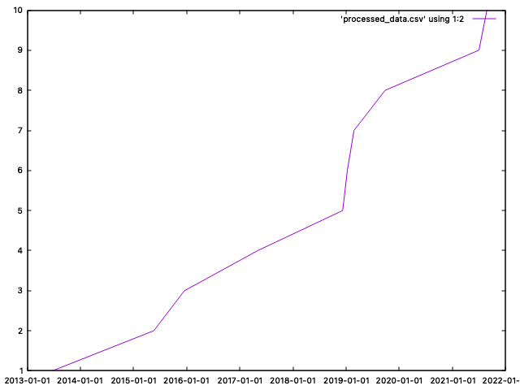

# Part 2 — Evaluation of Existing PoC

Repository reviewed: [json-schema-org/ecosystem](https://github.com/json-schema-org/ecosystem)
Path reviewed: `projects/initial-data/`

---

## Code Review

### What does it do well?

- **Comprehensive lifecycle metrics** — collects meaningful per-repository timestamps: creation date, first commit date, first release date, and topics. This is a strong foundation for analyzing ecosystem growth and maturity over time.
- **Pagination handled correctly** — uses `octokit.paginate.iterator` to iterate through all matching repositories rather than just the first page.
- **Incremental CSV writes via `DataRecorder`** — writing results row-by-row as repos are processed means partial progress is preserved if the run fails midway. This is a good operational choice for long-running jobs.
- **Per-repo error isolation** — one failing repo doesn't stop the entire run; errors are logged and skipped.
- **Basic tests included** — Jest tests cover `DataRecorder` and a basic Octokit call, which shows some engineering discipline.
- **README with visualization path** — documents a `csvkit` + `gnuplot` pipeline for turning the CSV into charts.

### What are its limitations?

- **Very API-call heavy** — for each repo it makes multiple requests: repo details, topics, releases, and commits. Fetching the "first commit" and "first release" requires discovering the `last` page from the Link header and requesting it — this is slow and error-prone when headers are missing or repos have unusual history.
- **Fragile error handling** — if a repo has no releases it throws, discarding any partial data already collected for that repo. Many repos legitimately have no releases, so this is a common failure case.
- **CSV-only output** — structured JSON would be far easier to extend, consume in a web UI, and store historically. CSV requires manual shell commands (`csvsort`, `csvcut`, `awk`, `gnuplot`) to visualize, which is not portable or automatable.
- **No automation** — the visualization pipeline is entirely manual. There is no GitHub Actions workflow or scheduling mechanism, so nothing runs automatically over time.
- **No rate-limit handling** — the README acknowledges the script is "slow on purpose" but there is no backoff, retry logic, or awareness of GitHub's rate limit headers.
- **Structural issues** — `main.js` has mixed responsibilities, there are typos like `processRespository.test.js`, and the README references an Internet Archive integration that isn't clearly present in the code, which would confuse new contributors.

### Did you try running it?

Yes. After setting `GITHUB_TOKEN`, `TOPIC=json-schema`, and `NUM_REPOS=10` in `.env`, running `pnpm start` immediately failed with:

```
Error: ENOENT: no such file or directory, open './data/initialTopicRepoData-1772633026073.csv'
```

The `./data/` directory is never created by the script — `DataRecorder` tries to write a CSV file into it but assumes the directory already exists. This is a straightforward bug: any fresh clone will hit this error before the script does any useful work.

The fix is a one-liner in `dataRecorder.js`:

```javascript
const dir = path.dirname(this.fileName);
if (dir) fs.mkdirSync(dir, { recursive: true });
```

I opened an [issue](https://github.com/json-schema-org/ecosystem/issues/18) and submitted a [PR](https://github.com/json-schema-org/ecosystem/pull/19) with this fix. This kind of missing setup step is a sign the project was never tested on a clean environment after initial development.

After creating the directory (`mkdir -p data`), I was able to run the script successfully. It processed multiple repositories and produced a timestamped CSV file under `./data/initialTopicRepoData-<timestamp>.csv`.

I also followed the README’s `csvkit` + `gnuplot` steps and produced a cumulative time-series plot. The chart represents the cumulative count of topic-tagged repositories over time (x-axis = repo creation date, y-axis = cumulative number of repos).



### Anything else worth noting?

The focus on _repository lifecycle metrics_ (creation date, first commit, first release) is a valuable and underexplored angle. Most ecosystem dashboards show current stats like stars or downloads — tracking when things first appeared can reveal how the ecosystem has matured over time. This idea is worth carrying forward into the GSoC project.

---

## Recommendation

### Should we build on this code or start fresh?

**Start fresh, but keep the approach and metric definitions.**

The PoC validates the core idea and identifies genuinely useful ecosystem metrics, but the implementation is tightly coupled, API-call heavy, and relies on a manual CSV + shell-command pipeline that isn't suitable for automated weekly runs. A fresh TypeScript implementation allows a cleaner architecture — structured JSON output, proper rate-limit handling, modular design — while preserving the proven metric choices and overall workflow philosophy.

### What to keep from the existing approach

- The **metric definitions**: repo creation date, first commit date, first release date, and topics — these are well-chosen signals for ecosystem maturity.
- **GitHub topic** (`topic:json-schema`) as the primary discovery mechanism.
- The idea of **incremental persistence** — writing results as they complete to handle long runs safely.
- The overall goal of producing a dataset suitable for visualizing **ecosystem growth over time**.

